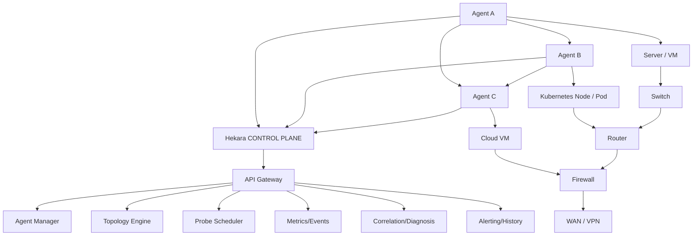
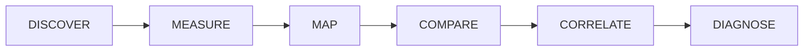

<!-- badges: start -->

# hekara

  
  

A Distributed Infrastructure and Network Path Observability Platform.

<!-- badges: end -->

## Overview

Hekara is a distributed infrastructure and network-path observability platform that deploys lightweight agents across servers, VMs, containers, and Kubernetes environments. The agents discover their local environment and actively measure network connectivity. The central controller collects these observations and builds a model of the infrastructure, correlating various data sources to identify probable fault domains.

> **Something is slow, unreachable, or unstable. Where exactly is the problem in our infrastructure or network, what changed, and what should we investigate?**

## Core Features

- **Distributed agents** for Linux, Windows, VMs, Kubernetes, and cloud instances
- **Active network measurements** using ICMP, UDP, and TCP
- **Topology discovery** and live graph visualization
- **Path history** and change detection
- **VPN and overlay network** awareness
- **Cross-agent correlation** for fault domain identification
- **Evidence-based diagnosis** with confidence scoring

## How It Works

## Process Flow

Hekara follows this observability process:

1. **DISCOVER** - What infrastructure exists?
2. **MEASURE** - How are systems actually reaching each other?
3. **MAP** - What relationships exist?
4. **COMPARE** - What changed?
5. **CORRELATE** - Which observations are related?
6. **DIAGNOSE** - Where does the problem probably begin?

## Project Components

- [backend](./backend) - main operation and management
- [agent](./agent) - agent install in every network nodes (devices, vms, etc)
- [cli](./cli) - cli client tool handle cli operations

## Use Cases

Hekara is valuable for:

- **Network troubleshooting** - Identify where connectivity issues begin in complex multi-hop paths
- **VPN diagnostics** - Detect when traffic is routed through encrypted tunnels and measure performance
- **Kubernetes network debugging** - Trace pod-to-service connectivity through CNI and overlay networks
- **Infrastructure changes** - Detect route changes, gateway shifts, and path modifications over time
- **Multi-site connectivity** - Compare reachability across different sites and understand asymmetric routing
- **Performance monitoring** - Track latency and packet loss trends to identify degradations before they become critical

## Target Users

- **SRE/DevOps teams** - Monitoring Kubernetes clusters, service mesh connectivity, and infrastructure health
- **Network engineers** - Troubleshooting cross-site connectivity, VPN performance, and routing issues
- **Site reliability engineers** - Detecting intermittent failures and path changes before they impact users
- **Cloud infrastructure teams** - Monitoring connectivity between cloud environments, VPNs, and on-premises networks
- **Application developers** - Understanding how their services connect to dependencies and diagnosing latency issues

## License

[APACHE 2.0](./LICENSE)
