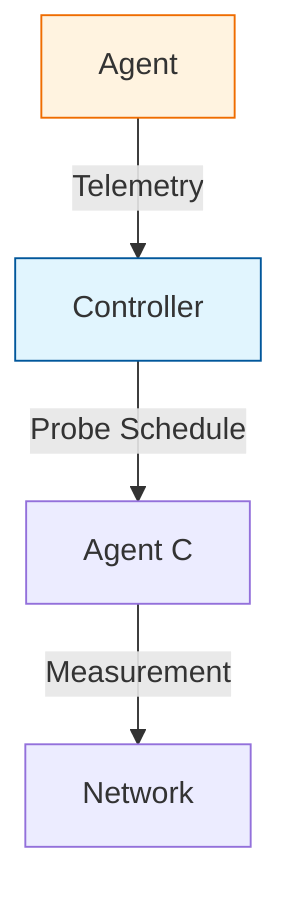

# SKILLS.md - Required Skills for Hekara Development

> **Project:** Hekara - Distributed Infrastructure and Network Path Observability Platform
> **Purpose:** Define the core competencies needed to build, maintain, and extend the project

```yaml
project: hekara
primary_language: Go
target_domain: distributed-systems, network-observability, kubernetes
compliance: APACHE 2.0
```

---

## 1. Core Development Skills

### Go (Golang) - Required

Hekara is primarily implemented in Go. Essential skills:

| Skill Area | Proficiency | Examples |
|------------|-------------|----------|
| **Language fundamentals** | Advanced | Goroutines, channels, interfaces, error handling, generics (1.18+) |
| **Concurrency** | Advanced | Worker pools, select statements, context propagation, atomic operations |
| **System programming** | Advanced | syscalls, network sockets, process management, signal handling |
| **Binary packaging** | Intermediate | Static binaries, cross-compilation (`GOOS`/`GOARCH`), `go build` flags |
| **Ecosystem** | Advanced | `go mod`, dependency management, `go vet`, `golangci-lint` |
| **Performance** | Intermediate | Profiling (`go tool pprof`), optimization, resource management |

**Typical Go tasks in Hekara:**
- Agent implementation (lightweight, cross-platform)
- Control plane services (gRPC, HTTP, API endpoints)
- CLI tooling with Cobra/Viper
- Network measurement packages (ICMP, UDP, TCP probes)
- Topology graph manipulation

```go
// Example: Agent discovery with proper error handling
func DiscoverAgent() (*AgentInfo, error) {
    info, err := collectSystemInfo()
    if err != nil {
        return nil, fmt.Errorf("agent discovery failed: %w", err)
    }
    
    // Validate collected data
    if err := validateAgentInfo(info); err != nil {
        return nil, err
    }
    
    return info, nil
}
```

### Cross-Platform Systems

- Linux: `/proc`, `/sys`, `netlink`, `iptables`
- Windows: Registry, WMI, PowerShell APIs
- Container: Docker/OCI specs, Kubernetes APIs, cgroups
- Resource constraints: Low memory/CPU footprint design

---

## 2. CLI & Tool Development Skills

### Command-Line Interface

- **Framework**: Cobra or Bosh for command structure
- **Configuration**: Viper for config management, environment variables, config files
- **Output formatting**: Table formatting, JSON/YAML output, human-readable displays
- **bash completion**: Auto-completion support for complex commands
- **Exit codes**: Proper error signaling, integration with shell scripts

**Hekara CLI requirements:**
```
HEKARA DIAGNOSE COMMAND
  hekara diagnose --source <agent> --destination <target>
  
  Output format:
  - Human-readable table with status, latency, path
  - JSON flag for pipeline integration: --json
  - Verbose mode: --verbose for debugging
  - Exit codes: 0=healthy, 1=degraded, 2=unreachable
```

### Measurement & Probe Tools

- Protocol implementation: ICMP, UDP, TCP ping/probe
- Timeout handling, retry logic, rate limiting
- Result serialization (protobuf, JSON)
- Platform-specific adaptations (raw sockets permissions, container restrictions)

---

## 3. Platform Developer Skills

### Distributed Systems

- Client-server architecture, control plane/measurement plane separation
- Secure communication: gRPC with TLS, mutual TLS, authentication
- Service discovery, agent registration, heartbeat mechanisms
- Idempotent operations, retry policies, circuit breakers

### Network Infrastructure Knowledge

- **OSI model understanding**: Layers 2-4 relevant to observability
- **Routing**: IPv4/IPv6, routing tables, default gateways
- **Network interfaces**: MTU, promiscuous mode, monitoring stats
- **VPN detection**: WireGuard, OpenVPN, IPsec, TUN/TAP interfaces
- **CNI awareness**: Calico, Cilium, Flannel, VXLAN, Geneve
- **DNS resolution**: Config, servers, search domains

### Kubernetes Integration

- Pod/container network namespace awareness
- CNI plugin understanding (used in section 27-28 of PLAN.md)
- Service mesh concepts (mTLS, sidecars)
- Cluster networking (CIDR, service CIDR, network policies)

---

## 4. DevOps & Infrastructure Skills

### CI/CD Pipeline

```yaml
# Example CI configuration (GitHub Actions)
name: CI/CD Pipeline

on:
  push:
    branches: [main]
  pull_request:
    branches: [main]

jobs:
  test:
    runs-on: ubuntu-latest
    steps:
      - uses: actions/checkout@v4
      - name: Set up Go
        uses: actions/setup-go@v5
        with:
          go-version: '1.23'
      - name: Run tests
        run: go test ./...
      - name: Lint
        run: golangci-lint run
      - name: Build
        run: go build ./...
  
  security:
    needs: test
    steps:
      - name: Vulnerability scan
        run: govulncheck ./...
  
  release:
    needs: security
    if: github.ref_name == 'main' && github.event_name == 'push'
    steps:
      - name: Create release
        uses: softprops/action-gh-release@v1
```

### Containerization & Orchestration

- Docker: Multi-stage builds, minimal base images, health checks
- Kubernetes: Deployments, DaemonSets (for agents), Services, ConfigMaps
- Orchestration: Agent deployment strategies, rolling updates, canary releases

### Monitoring & Observability (of the system itself)

- Self-monitoring: The project includes its own health checks (see AGENTS.md section 8)
- Metrics export: Prometheus metrics, export formats
- Logging: Structured logging (JSON), log aggregation
- Tracing: OpenTelemetry, distributed tracing

### Infrastructure as Code

- Terraform or similar for platform setup
- Helm charts for Kubernetes packaging
- GitOps patterns for configuration management

---

## 5. Testing & Quality Assurance

### Test Types

| Test Category | Focus | Tools |
|---------------|-------|-------|
| **Unit tests** | Individual functions, edge cases | `go test`, table-driven tests |
| **Integration tests** | End-to-end scenarios | `testify`, `mockgen`, Docker compose |
| **Property-based testing** | Randomized input validation | `fastcheck`, `test-gen` |
| **Chaos testing** | Failure injection, resilience | `chaos-mesh`, custom test harnesses |

### Quality Gates

- **100% coverage** on new code (enforced via `make coverage`)
- **golangci-lint** zero new issues
- **Mermaid diagram** syntax validation (`make diagrams`)
- **Security scanning**: `govulncheck`, dependency checks
- **Build verification**: `go build ./...` must succeed

### Test Data Management

- Fixtures in `internal/test/fixtures/`
- Versioned with code changes
- Scenario coverage: happy paths, error cases, edge cases, failure modes

---

## 6. Security Skills

### Core Principles (from PLAN.md sections 51-53)

| Principle | Implementation |
|-----------|----------------|
| **TLS everywhere** | Control plane communication, agent-controller channel |
| **Agent authentication** | Registration tokens, identity certificates, rotation |
| **Controller authentication** | mTLS, JWT, API keys with scopes |
| **Registration tokens** | Short-lived, scoped, one-time use |
| **Certificate rotation** | Automated via ACME or internal CA |
| **RBAC** | Role-based access control for CLI/commands |
| **Least privilege** | Agents: minimal capabilities, no shell access |
| **Audit logs** | All agent actions, configuration changes |
| **Probe authorization** | Allowed targets, protocols, ports, rates |
| **No arbitrary remote execution** | Predefined capabilities only |

### Specific Hekara Security Requirements

```yaml
probe_policy:
  allowed_targets:
    - 10.10.0.0/16
    - api.internal.example
  protocols:
    - icmp
    - tcp
    - udp
  allowed_ports:
    - 443
    - 8443
  max_packet_size: 1400
  max_rate: limited
  max_concurrency: 10
```

### Common Security Tasks

- Input validation for all CLI commands
- Secure configuration handling (env vars, config files)
- Secrets management (no hardcoded credentials)
- Rate limiting to prevent abuse
- Audit trail for all operations

---

## 7. Architecture & Diagramming Skills

### Mermaid Diagram Proficiency

Hekara uses mermaid diagrams extensively (README.md, PLAN.md). Skills needed:

- **Syntax**: `graph TD`, `flowchart LR`, `classDef`, node/edge definitions
- **Layout**: hierarchical, flowchart, class diagrams
- **Validation**: `npx @mermaid-js/lint` integration in CI
- **Updates**: When architecture changes, diagrams must be updated

**Example mermaid skill requirements:**



### System Architecture Understanding

- Reading PLAN.md sections (1-62) to understand design decisions
- Translating text specifications into mermaid visualizations
- Keeping diagrams consistent with code implementation
- Documentation-driven development approach

---

## 8. Domain-Specific Knowledge

### Network Path Observability

From PLAN.md core question:

> **"Something is slow, unreachable, or unstable. Where exactly is the problem in our infrastructure or network, what changed, and what should we investigate?"**

Skills to address this:

- **Path correlation**: Connecting observations from multiple agents
- **Fault domain identification**: Determining likely failure locations
- **Change detection**: Route changes, VPN state, performance degradation
- **Evidence-based diagnosis**: Not assuming, but proving connections

### VPN & Overlay Networks

From PLAN.md sections 24-26:

- WireGuard, OpenVPN, IPsec detection
- Not assuming `wg0 exists = VPN confirmed`
- Multiple evidence sources: peers, endpoints, routes, handshakes
- Representing VPN as overlay on top of underlay

### Kubernetes CNI Awareness

From PLAN.md sections 27-28:

- Calico, Cilium, Flannel, VXLAN, Geneve
- Not hard-coding one implementation
- Multi-layer topology: Pod → CNI → Overlay → Node → Physical

---

## 9. Skill Assessment Matrix

### New Contributor Onboarding

| Skill | Self-Rating (1-5) | Training Resource |
|-------|-------------------|-------------------|
| Go programming | | AGENTS.md section 1, Go docs |
| CLI development | | Cobra docs, Viper guide |
| Networking fundamentals | | PLAN.md sections 1-20 |
| Kubernetes concepts | | PLAN.md sections 27-28 |
| CI/CD pipelines | | AGENTS.md section 5 |
| Mermaid diagrams | | `make diagrams`, lint config |
| Security principles | | PLAN.md sections 51-53 |

### Maintainer Expectations

| Area | Expectation | Evaluation |
|------|-------------|------------|
| Code quality | `golangci-lint` zero issues | PR review |
| Test coverage | 100% new code | `make coverage` |
| Diagram accuracy | Diagrams match code | Maintainer sign-off |
| Documentation | AGENTS.md, README.md, PLAN.md | Consistent |
| Security | No vulnerabilities | `govulncheck` pass |
| Performance | Agent resource limits | Load testing |

---

## 10. Learning Resources for Hekara

### Internal Documentation

- **PLAN.md**: Project architecture and design decisions (62 sections)
- **README.md**: Overview, features, getting started
- **AGENTS.md**: Contributor guidelines, development workflow
- **SKILLS.md**: This file - required competencies

### External Resources

| Topic | Resource |
|-------|----------|
| Go language | https://go.dev/doc/ |
| Cobra CLI | https://github.com/spf13/cobra |
| Viper config | https://github.com/spf13/viper |
| Mermaid | https://mermaid.js.org/ |
| Kubernetes networking | CNCF curriculum |
| gRPC | https://grpc.io/docs/ |
| Network measurement | RFC 792 (ICMP), RFC 2544 (throughput) |

### Recommended Skill Development Path

1. **Clone and explore** - `git clone`, read PLAN.md, run `make test`
2. **Set up environment** - Install tools (`go`, `pre-commit`, `golangci-lint`)
3. **Run the full cycle** - `make test`, `make lint`, `make diagrams`
4. **Pick a component** - Start with agent, CLI, or backend based on interest
5. **Write first PR** - Fix docs, add test, improve diagram
6. **Graduate to features** - Implement small feature, follow full workflow

---

*This skills framework is maintained as code alongside the project. Updates follow the AGENTS.md review process. Last reviewed: `git log -1 --format=%ci`.*

*For skill gaps or training questions, please open a discussion in [GitHub Discussions](https://github.com/anomalyco/hekara/discussions) or contact maintainers.*